# NailBook Redesign — Design Inspiration & Direction

**Prepared as:** senior product designer review
**Method:** every reference below was rendered in a headless browser and analyzed screen-by-screen with a vision model (not guessed from titles). Raw per-reference analyses: [`REDESIGN-RAW-ANALYSES.md`](./REDESIGN-RAW-ANALYSES.md). Hero screenshots: [`redesign-refs/`](./redesign-refs/).
**Scope:** 4 Behance case studies, 16 Dribbble shots, 6 real booking products (g.bar was unreachable).

---

## 0. TL;DR — the decision

Your current app is already **warm-cream + serif editorial**. The problem isn't the direction, it's the **execution** (heavy dark CTA bar, washed-out hero, dead space, weak hierarchy). Two coherent lanes emerge from your own saved references:

| | **A · Soft Luxury (recommended)** | **B · Vibrant Beauty** |
|---|---|---|
| Feel | premium nail atelier, calm, editorial | energetic, mass-market, playful |
| Action color | near-black ink `#1A1A1A` | hot pink/coral `#EC4899`/`#F26B5E` |
| Accent | one restrained dusty-rose `#C98A94` | pink is both accent + action |
| Type | display serif (brand) + Vazirmatn (UI) | single rounded geometric sans |
| Canvas | warm off-white `#F7F5F2` | white / pale pink `#FDF2F5` |
| Best refs | NAILIC, La Manière, Smart Glow, Treatwell, SoGlow | Veloura, Nail-Extension, BlissBo, Insurance, Food-AI, Fresha |

**Recommendation:** go **A**, but steal B's **booking-flow mechanics** (search-first hero, category quick-picks, grouped time slots, sticky confirm, social proof). Details in §4–6.

---

## 1. What the real products do (production UX, not concepts)

These six are shipping at scale — trust their **flows** over concept shots' **decoration**.

- **Fresha** — lavender→pink gradient hero; a **3-segment search card** (treatment · location · date); a live **"666,056 appointments booked today"** counter directly under search; horizontal **Recommended** cards with *Featured* badges + heart. Extra-bold single-family headline.
  → *Steal: the 3-part search card + the "booked today" trust counter.* 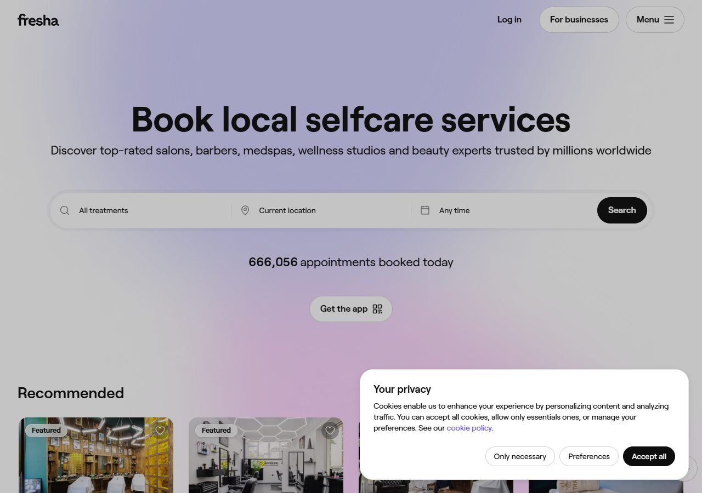
- **Booksy** — moody full-bleed **manicure photo** hero with white text popping; category strip (Hair · Barbers · **Nails** · Spa…); business profile with **4.9 rating** + tabs (Services · Reviews · Portfolio · Gift Cards) + "Popular Services" rows each with a **Book** button; **weekly calendar with color-coded slots**.
  → *Steal: photo-forward hero, rating + tabbed profile, color-coded availability calendar.* 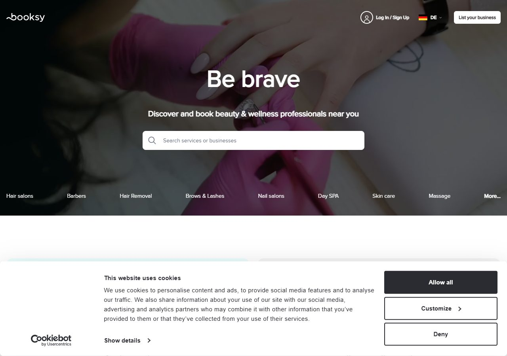
- **Treatwell** — **serif wordmark** + **bold serif headline** ("The brighter way to book beauty") over clean sans body; white 3-field search card; "What's hot on socials" rounded thumbnail row; 3-icon value props (Smart prices · Book 24/7 · Top-rated); gift-card + "5 Years Top Rated" promo cards.
  → *Steal: serif+sans pairing for premium feel; the 3 value-prop icon row; social-proof promo cards.* 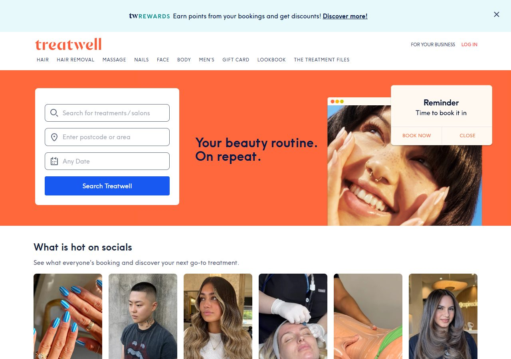
- **StyleSeat** — dark-green hero block, white search, condensed uppercase logo, lifestyle image, card carousel. (Their mascot is a tiny crown line-art — a brand-mark idea.) 
- **Vagaro** — busy salon-photo hero, red "For Business" CTA, 3-part search, **4-col deal grid** with discount badges + star ratings. (Deal grid = good for promos, but visually noisy — don't copy the clutter.) 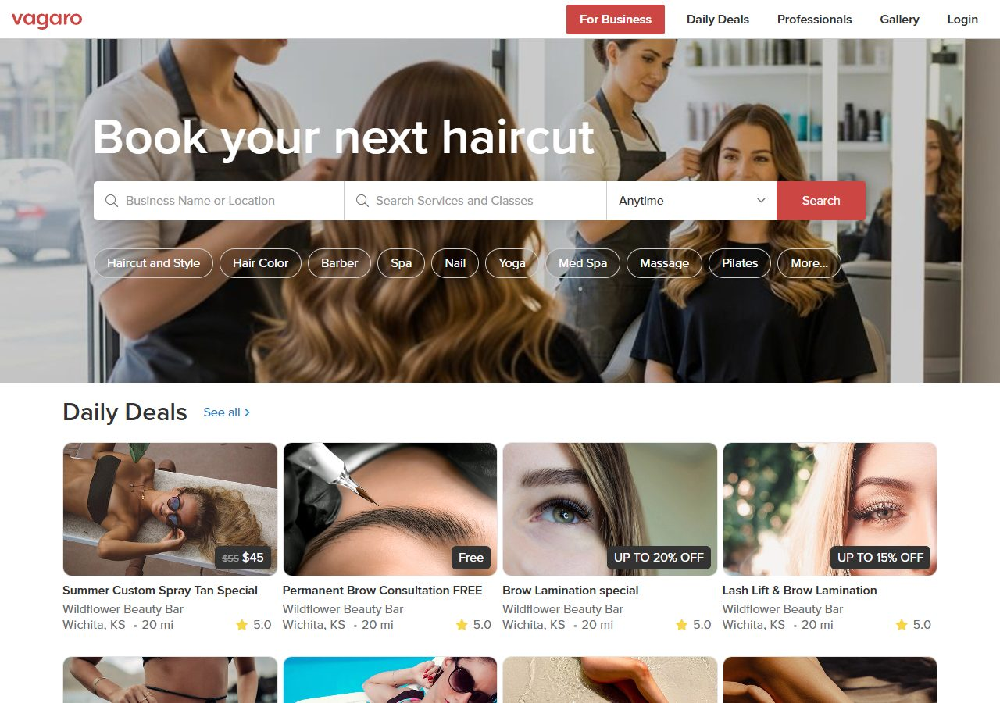
- **DIKIDI** — dark-blue gradient hero, big rounded search, **7 category icon tiles**, tab bar (Selection · Catalog · Deals · Map · Favorites · My appointments). Functional/corporate, not pretty. 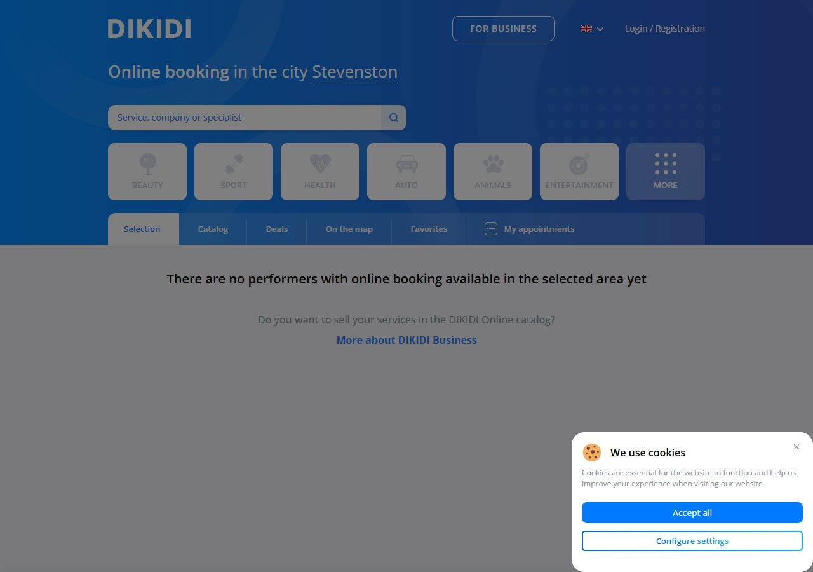

**Consensus across all six:** lead with **search**, put **categories one tap below**, flood the page with **social proof** (ratings, "booked today", "top rated"), use **horizontal carousels** for discovery, and keep a **persistent bottom nav**.

---

## 2. What the concept shots contribute (decoration & craft)

- **NAILIC** (Catherine Teng) — the most on-brand for you: white/`#F5F5F5`, charcoal `#2E2E2E` text, **dusty-mauve `#C9A0A0`** used *sparingly*, **charcoal `#333` as the action color**, geometric sans, "Just nail your aesthetic" hero, nail-polish logo mark. Premium-minimal. → *Steal: the logo concept + the "dark action, one soft accent" discipline.* 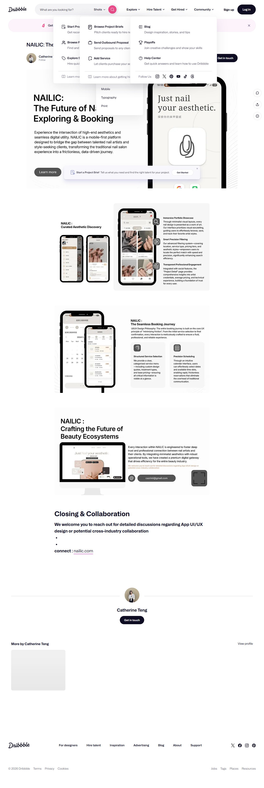
- **La Manière** (Outcrowd) — clean white, single-family, **black `#000` buttons + soft pink `#E8A0B4` hover**, generous spacing. Elegant but *under-saturated for nails* — borrow the restraint, add warmth. 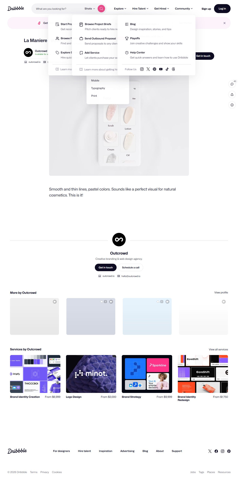
- **Smart Glow** (skincare) — **blush `#F5E9E9` hero**, off-white `#FAFAFA`, near-black `#3D3D3D` CTA, **calendar grid with a filled dark selected-date circle**. Calm spa hierarchy. → *Steal: blush hero + selected-date treatment.* 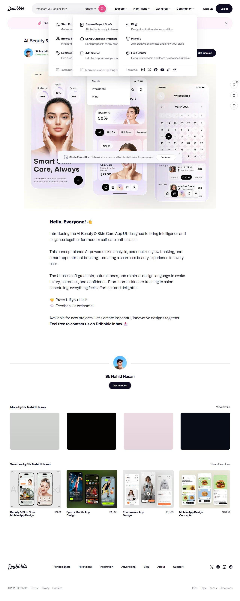
- **SoGlow** (Behance) — **elegant display serif + modern sans** pairing; pastel category tiles (Nails lavender `#D9C7F0`, Makeup pink `#F5D0D8`, Facial aqua `#A9D6D5`, Hair coral `#F2BFA8`); dark-navy CTA; 5-icon bottom nav. → *Steal: serif/sans pairing + pastel category tiles (if you lean B).* 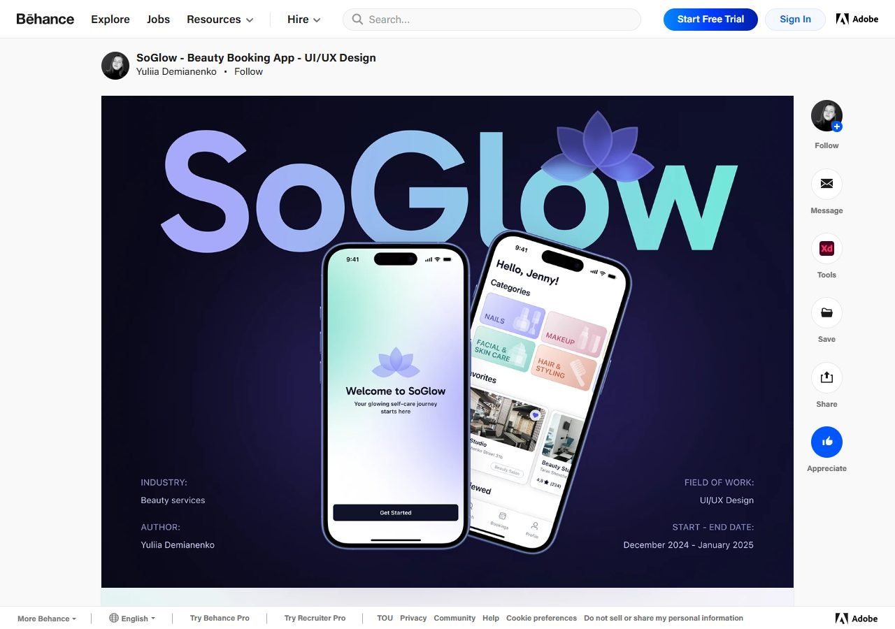
- **Veloura** (salon case) — `#F5F5F5`, **coral-pink `#FF5A6E`** accent, icon-driven category row, recommended carousel, radius 16–20px, soft shadows. Clean B-lane template. 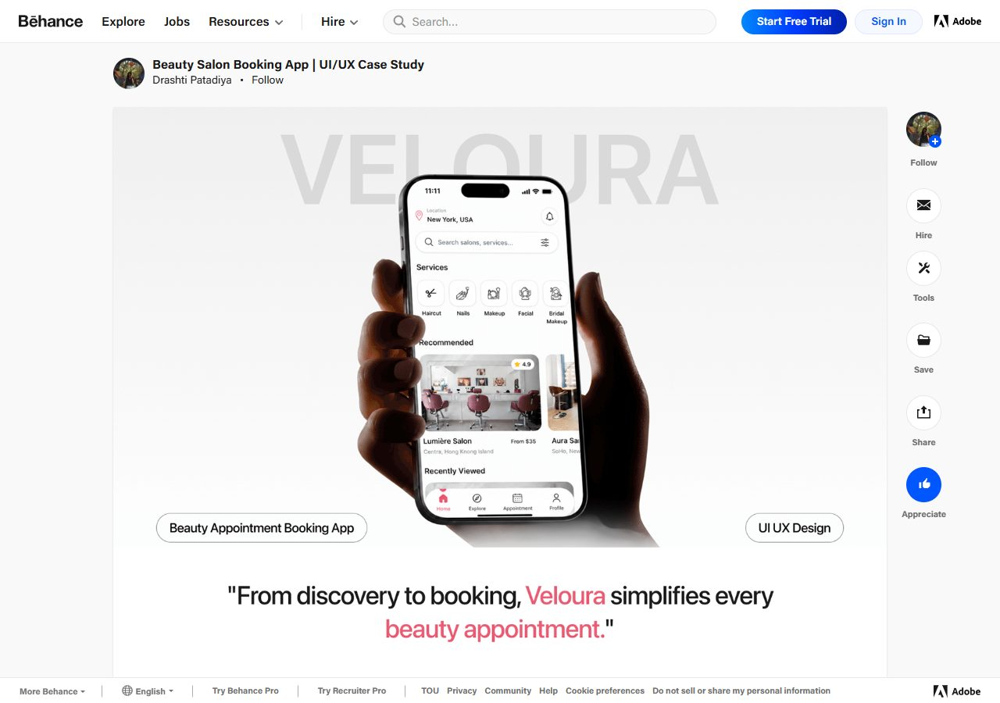
- **Nail-Extension** — **hot-pink `#EC4899`** dominant, `#FDF2F5` bg, radius 16–24px, pink-gray shadows; **profile + Instagram/social login** (your note). → *Steal: social-login-on-profile pattern.* 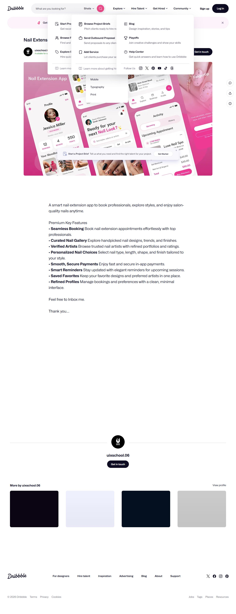
- **Anywhere Ride** — floating cards over a map, **pill destination input**, stacked option cards (icon · label · price · circular arrow button), **fixed bottom "Book now" bar**. → *Steal: the stacked option-row + circular affordance + sticky CTA (maps directly to your service/time rows).* 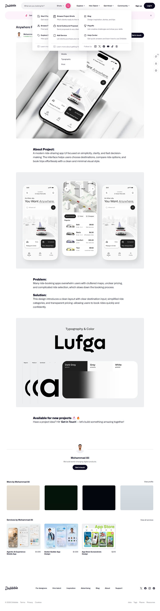
- **Doctor Booking** (Orbix) — **visual body/hand map to pick a service** (→ a *hand/nail selector*!), find-list with search + filter chips, profile with slots, **sticky bottom "ثبت نوبت"**, **top-rated badge** on first items. → *Steal: the hand/nail visual selector + top-rated badge.* 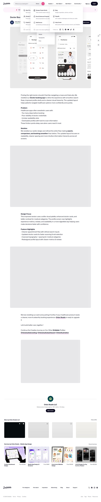
- **Salon CRM** (Mara Bureau) — desktop **owner dashboard**: left sidebar, **calendar timeline grid**, right detail panel, floating edit modal; `#F9F9FA`, hot-pink `#FA2C56` accent, lavender `#D6C6E9`. → *Steal: the owner timeline layout (mirror for RTL).* 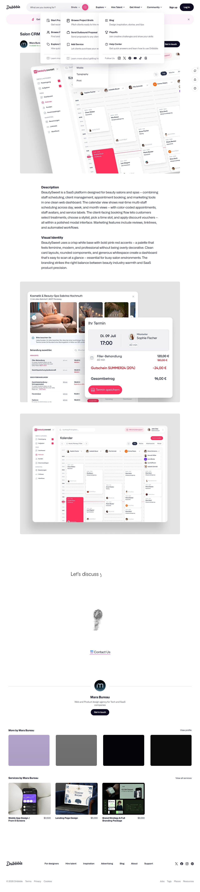
- **Hypershell / Insurance / Food-AI / Agentic / BlissBo** — motion & system craft: **floating overlay menu** (→ bottom-sheet), **pill chips**, **tabular figures for numbers**, coral/pink accents on off-white, barcode confirmation screen. → *Steal: bottom-sheet menus, chip filters, tabular numerals, a barcode/receipt confirmation.* 
- **Onboarding (VAILS)** — full-bleed hand photo + single CTA; a **nail configurator** (shape/length/color sliders). → *Steal: tactile full-bleed welcome; optional "find your style" quiz.* 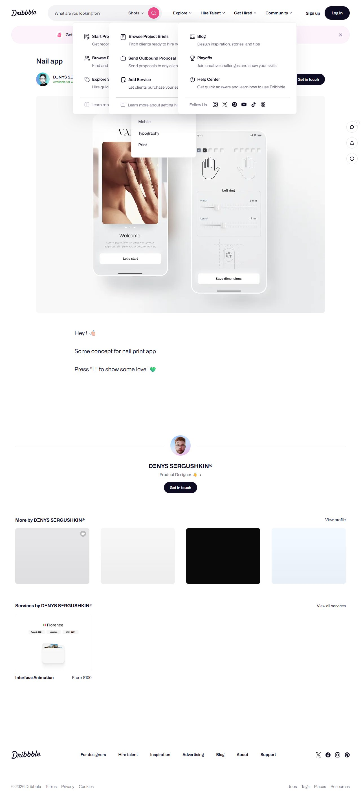

*(dr-luxury-salon resisted automated analysis; from the partial read it's a 3-column card-carousel homepage — revisit manually if you want it.)*

---

## 3. Cross-cutting patterns (what keeps winning)

1. **Search-first hero** (real products) vs **brand+single-CTA hero** (concepts). For a *single-salon* app like Forehand you don't need discovery-search — you need **"Pick a service → Pick a time → Confirm"** fast. So: hero = brand + one clear "رزرو" CTA, then straight into the flow.
2. **Category/quick-pick row** one tap below the fold.
3. **Social proof**: ratings, "N booked this week", top-rated badges, review snippets, "years top rated".
4. **Horizontal carousels** for lookbook / services / artists.
5. **Persistent bottom nav** (4–5 items) — thumb-reachable, RTL-safe.
6. **Sticky bottom CTA** through the booking flow.
7. **Cards + big radius (16–24px) + soft diffused shadows + generous whitespace.**
8. **Type:** single geometric sans with weight-driven hierarchy is the norm; the *premium* ones add a **display serif** for brand/emotion.
9. **Color discipline:** either **pink-as-action** (B) or **ink-as-action + one soft accent** (A). The luxury ones all converge on the latter.
10. **Calendar:** date grid, **filled circle on selected date**, time slots **grouped morning/afternoon/evening**, unavailable slots hatched/muted.

---

## 4. Recommended design system for NailBook (Direction A)

Concrete tokens to replace the current "Clean Slate" monochrome. Keep your Vazirmatn; add a serif for display.

### Color
```
--canvas        #F7F5F2   warm off-white (page bg)
--surface       #FFFFFF   cards, sheets
--surface-2     #F1EEE9   wells, chips bg, hatched slots
--ink           #1A1A1A   primary text AND primary action (buttons)
--ink-2         #6B6B6B   secondary text
--ink-3         #9A9A9A   tertiary / disabled
--line          #E7E2DB   hairline borders
--accent        #C98A94   dusty rose — used SPARINGLY (selected, links, price highlight)
--accent-soft   #F3E3E1   blush hero bg, selected chip bg
--success       #16A34A   (keep)
--danger        #DC2626   (keep)
```
Dark mode: canvas `#0E0D0C`, surface `#171513`, ink `#F5F2EE`, accent `#D9A6AE`. (Your dark-mode plumbing already works — just re-map tokens.)

**Rule:** the primary button is **ink (`#1A1A1A`)**, not pink. Pink is a *highlight*, not the default action. This is the single biggest lever to feel "premium atelier" instead of "generic app."

### Typography
- **Display / brand / hero:** a serif — Latin wordmark "Forehand Nail" in e.g. *Fraunces* or *Canela*; Persian display in **Morabba** (or Vazirmatn 800 if you want one family).
- **UI / body:** **Vazirmatn** (already loaded) — 400 body, 500 labels, 600 subheads, 700–800 headings.
- **Numbers (price, time, duration):** **tabular figures**, Latin digits for prices/times is fine and common in Iranian apps — but be *consistent* (right now you mix Persian/Latin digits).
- Avoid weight < 400 at small sizes (Farsi strokes get fragile).

### Shape & depth
- Radius: `sm 12 · md 16 · lg 20 · xl 24 · pill 999` (bump current 14 → 16/20).
- Shadows: keep your warm multi-layer system; soften further (`0 2px 8px rgba(26,20,18,.05), 0 8px 24px rgba(26,20,18,.06)`).
- Borders: hairline `--line` on cards; no heavy outlines.

### Motion
- Keep your spring easings. Add: bottom-sheet slide-up for menus/filters (Hypershell pattern), cross-fade hero, 40ms stagger on card grids (you already have `animate-stagger`). Respect `prefers-reduced-motion` (already handled).

---

## 5. Per-screen redesign guidance

**Home / landing**
- Full-bleed **blush `--accent-soft`** hero with a real manicure photo (fix the current washed-out hero — increase contrast, darken overlay so white text pops, Booksy-style).
- Serif brand line + one-line value prop + **single ink "رزرو نوبت" CTA**.
- Below fold: **horizontal lookbook carousel** (your highlights), a **3-item value row** (icons: quality · hours · location — Treatwell pattern), **social proof** ("★ 4.9 · N رزرو این هفته"), then service list.
- Kill the heavy dark CTA bar → replace with a **sticky bottom pill CTA** that appears on scroll.

**Booking flow (service → date/time → confirm)**
- **Progress indicator** (3 steps) at top — you have `booking-progress`, restyle to thin ink bar + accent for current.
- Service select: card rows (image · name · duration · price · circular chevron) — Anywhere-Ride pattern.
- Date: **Jalali calendar grid, filled accent circle on selected day** (Smart Glow).
- Time: **grouped morning/afternoon/evening**, selected = ink chip, unavailable = hatched `--surface-2` (you already have `.bg-hatched`).
- Sticky bottom **"ادامه / ثبت نوبت"** with live total.

**Confirmation / receipt**
- Delight moment: success check + **barcode/QR receipt card** (BlissBo) + "add to calendar" + share. You already have `printed-receipt`/`receipt-card` — restyle to the new tokens.

**Profile**
- Header card + **social/Instagram connect** row (your Nail-Extension note) + upcoming bookings + "change PIN".

**Owner timeline (`/owner`)**
- Adopt the **Salon-CRM layout mirrored for RTL**: date strip → vertical hour grid → color-coded appointment blocks (reserved/confirmed/completed/cancelled) → tap opens bottom-sheet detail. Keep your existing timeline data, just re-skin.

---

## 6. Prioritized "steal this" list

**Do first (highest impact, low effort):**
1. Switch primary action color **pink → ink `#1A1A1A`**; reserve rose for highlights. *(instant premium)*
2. Warm off-white canvas `#F7F5F2` + hairline borders + radius 16/20.
3. Fix hero: real photo, darker overlay, white text pops, single CTA.
4. Sticky bottom pill CTA in booking flow (replace heavy bar).
5. Grouped time slots + filled-circle selected date.
6. Social proof: rating + "booked this week" counter.

**Do next:**
7. Add a **display serif** for brand/hero (Fraunces/Morabba) vs Vazirmatn UI.
8. Horizontal lookbook carousel on home.
9. Bottom-sheet menus/filters (Hypershell).
10. Tabular numerals, consistent digits.
11. Top-rated badge on featured services (Doctor).
12. Barcode/QR receipt confirmation (BlissBo).

**Consider (bigger):**
13. Hand/nail visual selector to pick a service (Doctor's body-map idea).
14. "Find your style" onboarding quiz (VAILS configurator).
15. Owner dashboard re-skin to CRM timeline pattern.

**Avoid:**
- Vagaro's busy multi-photo deal grid (clutter).
- La Manière's pure-black-on-white (too cold for nails — keep the warmth).
- DIKIDI's corporate all-caps tiles.
- Pink-as-everything (B-lane) unless you deliberately want mass-market.
- Nested cards, sharp corners, pure `#000`/`#FFF` (your DESIGN.md rules still hold).

---

## 7. RTL / Persian notes (surfaced repeatedly)
- Mirror *everything*: back arrows, progress, timeline, search icon to the right, chevrons flip.
- Persian type stack: **Vazirmatn** (UI) + **Morabba** (display) — both handle Persian well; avoid thin weights small.
- Center-align short Persian headlines; right-align body.
- Keep Jalali calendar + Asia/Tehran logic (already solid in code).
- Decide digits once: Latin tabular for price/time is standard and readable.

---

*Next step: pick A or B (or "A with X from B"), and I'll turn §4–5 into a real `DESIGN.md` + token changes in `globals.css`/`design-tokens.ts` and rebuild the home + booking screens.*
